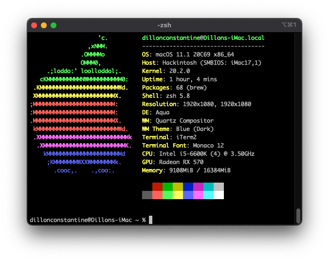

# Z170-A OpenCore

This repo is the result of following the [OpenCore documentation](https://dortania.github.io/OpenCore-Install-Guide/) for a Z170-A + Skylake setup.

Most recently tested with macOS Big Sur 11.1.

## BIOS Changes

These changes are based on using the optimized defaults as a starting point. The latest BIOS update 3802 is being used. 

| Name                            | Change                          |
|---------------------------------|---------------------------------|
| Intel Virtualization Technology | Disabled → Enabled             |
| SW Guard Extension (SGX)        | Software Controlled → Disabled |
| Serial Port                     | Enabled → Disabled             |
| Fast Boot                       | Enabled → Disabled             |
| Above 4G Decoding               | Disabled → Enabled             |
| Launch CSM                      | Enabled → Disabled             |
| OS Type                         | Other OS → Windows UEFI Mode   |
| IGPU Multi-Monitor              | Disabled → Enabled             |
